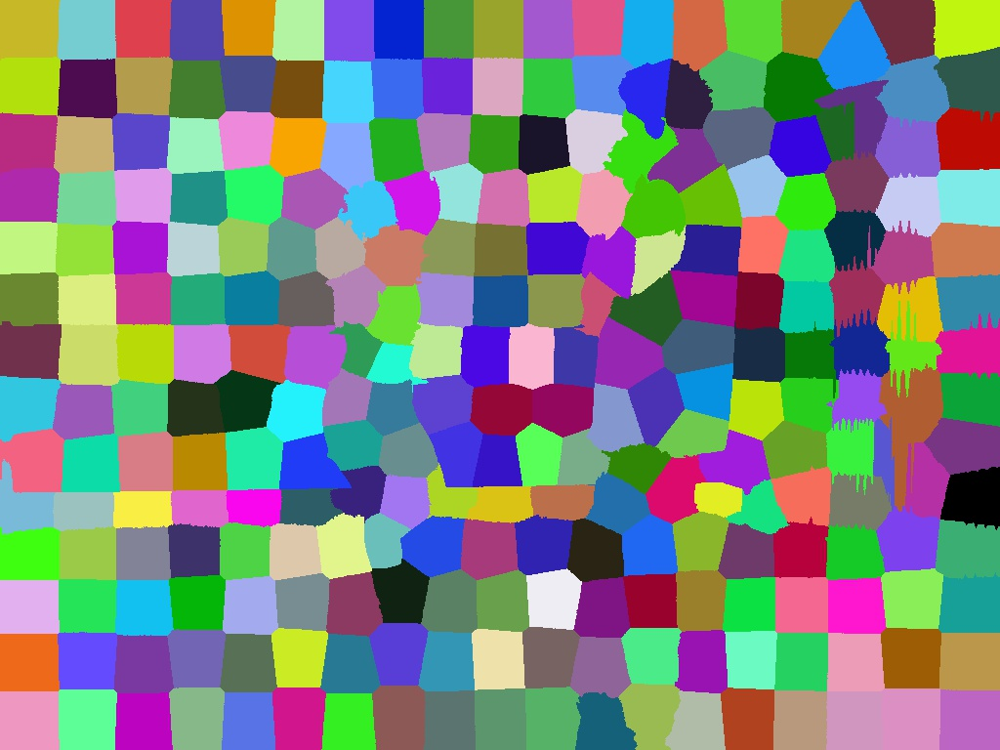
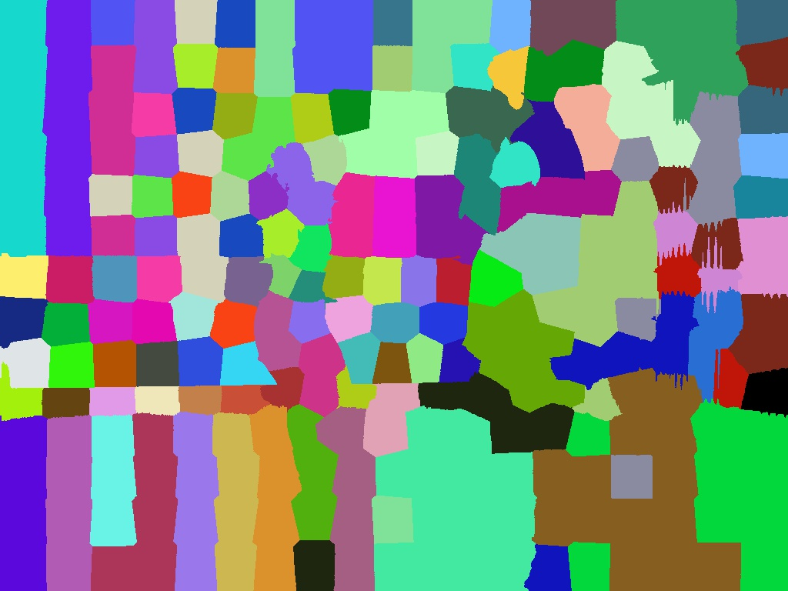
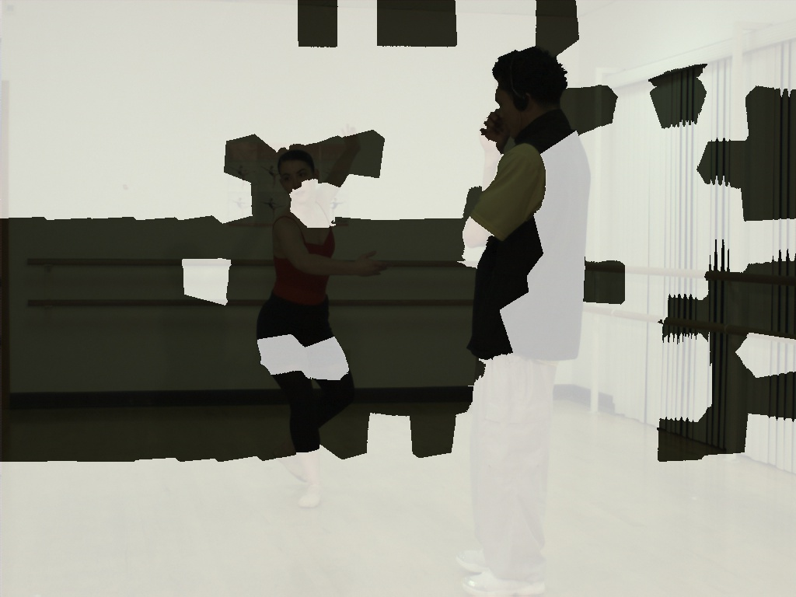
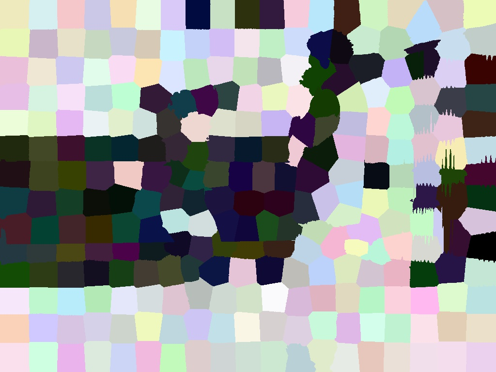

## ViewAndTime
deformation-develop

### How to use(in ubuntu)

in ViewAndTime path,

    $ cd build

    $ cmake ..

    $ make -j4

### Example
1. for those original surpixels, like

<<<<<<< HEAD
1. for those original surpixels, like

	
    
2. for those updated surperpixel, like

merge with original image, like

=======

    
2. for those updated surperpixel, like

3. merge with original image, like

>>>>>>> master

